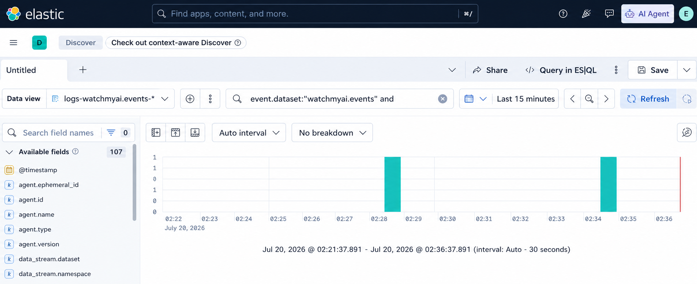
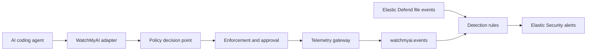
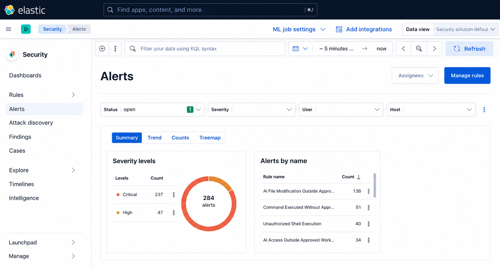

# WatchMyAI

[](https://github.com/rabbiteyesec/WatchMyAi-DaC/actions/workflows/watchmyai-ci.yml)
[](https://github.com/rabbiteyesec/WatchMyAi-DaC/actions/workflows/codeql.yml)
[](https://www.python.org/)
[](LICENSE)

## Detection-as-Code for AI Agent Security

WatchMyAI monitors AI coding agent activity at supported hook and gateway boundaries, applies
policy before mediated actions execute, emits normalized security telemetry, and supplies
Detection-as-Code rules for Elastic Security. The CLI is the operator interface to this wider
runtime and detection system.



*AI-generated interface illustration of Elastic Discover querying the `watchmyai.events` dataset.
It is not retained laboratory evidence or a current deployment result.*

## Core capabilities

- pre-tool policy decisions with `ALLOW`, `DENY`, `REQUIRE_APPROVAL`, and `MONITOR` effects;
- restrictive development policy and organization-signed production policy modes;
- policy enforcement for supported Claude Code, Codex CLI, and MCP integration boundaries;
- redacted schema 1.1.0 telemetry with durable per-session evidence chains;
- direct HTTPS export to the `watchmyai.events` Elastic dataset;
- reviewed Elastic data-stream, ingest, lifecycle, and optional investigation assets;
- 20 packaged Elastic Security rules with synchronized metadata, fixtures, and playbooks;
- static, connected, and current-run validation tools; and
- CLI workflows for setup, verification, validation, approvals, policy administration, and
  uninstall.

## How WatchMyAI works

1. An adapter converts a supported agent action into a canonical tool request.
2. The policy decision point classifies the action and resolves the applicable policy.
3. The enforcement point allows, denies, monitors, or holds the action for bound approval.
4. The runtime redacts and normalizes the decision and execution evidence.
5. The gateway exports schema 1.1.0 events to Elastic.
6. WatchMyAI rules correlate gateway and native endpoint evidence into Elastic Security alerts.

WatchMyAI is not a kernel sandbox and cannot control an execution path that bypasses its supported
hooks or gateways.

## Architecture overview



Eighteen production rules consume `logs-watchmyai.events-*`. `WMAI-023` and `WMAI-024` aggregate
native ECS file events collected by Elastic Defend. See the
[architecture guide](docs/ARCHITECTURE.md) for trust boundaries, policy flow, failure behavior, and
the validated deployment topology.

## One project with two internal components

| Area | Responsibility |
| --- | --- |
| [`telemetry-gateway/`](telemetry-gateway/README.md) | Policy, approvals, enforcement, evidence, adapters, normalization, export, and the `watchmyai` CLI. |
| [`detection-rules/`](detection-rules/README.md) | Rule reconciliation, validation, fixtures, playbooks, packaging, and the deferred research catalog. |
| Root tooling | Installation, setup support, import, preflight, validation, release packaging, and project metadata. |

The root [`VERSION`](VERSION), [`pyproject.toml`](pyproject.toml), [`LICENSE`](LICENSE), and release
workflow govern both components. Neither component is a separately published product.

## Release v1.0.0 contract

| Contract | Value |
| --- | --- |
| Product version | 1.0.0 |
| Production rules | 20 |
| Excluded v1.0.0 rules | 10 |
| Deferred research rules | 45 |
| Telemetry schema | 1.1.0 |
| Canonical dataset | `watchmyai.events` |
| Validated Elastic version | 9.4.3 |
| Validated live host | Ubuntu 24.04 |
| Supported Python | 3.11 and 3.12 |
| Windows | Bootstrap installer supported; live Elastic deployment not validated for v1.0.0 |
| Dashboard | Not required |

Elasticsearch, Kibana, Fleet Server, and an enrolled Elastic Agent must already exist. WatchMyAI
does not provision that external infrastructure. Other platform versions and deployment topologies
require their own qualification.

## Quick start

Clone the repository using the URL shown by its GitHub **Code** menu. From the checkout:

```bash
cd watchmyai
./scripts/install/install.sh
# Export the Elastic and Fleet values described in docs/QUICKSTART.md.
.venv/bin/watchmyai setup --development
.venv/bin/watchmyai verify
.venv/bin/watchmyai validate
```

Development setup enables rules only because that validation mode was selected explicitly. Signed
production setup requires organization-controlled policy inputs and explicit rule enablement.
Follow the complete [quick start](docs/QUICKSTART.md) before running a connected deployment.

## Detection-rule summary

The active stable IDs are `WMAI-001`, `WMAI-002`, `WMAI-007`, `WMAI-009`, `WMAI-022`,
`WMAI-023`, `WMAI-024`, `WMAI-025`, `WMAI-030`, `WMAI-048`, `WMAI-051`, `WMAI-053`,
`WMAI-054`, `WMAI-055`, `WMAI-057`, `WMAI-058`, `WMAI-059`, `WMAI-060`, `WMAI-061`, and
`WMAI-063`.

The authoritative import-safe source is
[`deployment/rules_schema_1.1.0.ndjson`](deployment/rules_schema_1.1.0.ndjson). Rules are disabled
in source. The [detection-rule catalog](docs/DETECTION_RULES.md) documents each rule's purpose,
severity, data source, behavior, metadata, and playbook. Excluded and deferred IDs are not
supported deployment content.

## Telemetry and Elastic integration

The gateway writes to `logs-watchmyai.events-default` through reviewed schema, component-template,
ingest-pipeline, index-template, and ILM assets. Setup can also install optional Kibana data views
and saved searches. No dashboard is required.

Static validation checks schemas and generated-rule parity without external services. Connected
verification checks Elastic, Kibana, Fleet, the enrolled agent, current telemetry, and current
correlated alerts. The [Elastic integration guide](telemetry-gateway/docs/ELASTIC_INTEGRATION.md)
describes the lower-level component boundary.

## Repository structure

```text
WatchMyAI/
|-- .github/             CI, security scanning, and protected deployment workflows
|-- deployment/          authoritative production-rule source
|-- detection-rules/     internal detection component
|-- docs/                operator, security, and contributor documentation
|-- fixtures/            canonical telemetry fixtures
|-- release/             machine-readable release and validation status
|-- scenarios/           controlled rule-validation scenarios
|-- scripts/             install, import, validation, and release tooling
|-- src/                 importable watchmyai Python package
|-- telemetry-gateway/   gateway deployment assets, fixtures, tests, and component documentation
|-- tests/               project-level consistency and hardening tests
|-- VERSION              one product version
|-- pyproject.toml       one Python package and tool configuration
`-- LICENSE              one Apache-2.0 licence
```

## Interface illustrations



*AI-generated interface illustration of Elastic Security grouping alerts by severity and rule name.
The displayed counts are illustrative and are not an efficacy, false-positive-rate, or deployment
claim.*

These illustrations are not evidence or release gates. Any future deployment evidence must be
current, authentic, and sanitized before publication; no dashboard image is required.

## Documentation index

- [Quick start](docs/QUICKSTART.md): shortest supported checkout-to-current-alert path.
- [Documentation index](docs/README.md): guides by audience and task.
- [Installation](docs/INSTALLATION.md): platforms, packages, upgrades, and reinstalls.
- [Setup and configuration](docs/SETUP_AND_CONFIGURATION.md): complete operator workflow.
- [Configuration reference](docs/CONFIGURATION.md): inputs, defaults, validation, and secrets.
- [Verification](docs/VERIFICATION.md): static, connected, and current-alert result meanings.
- [Troubleshooting](docs/TROUBLESHOOTING.md): symptom-based diagnostics and exit codes.
- [Changelog](CHANGELOG.md): release history and notable changes.
- [Security policy](SECURITY.md): reporting and sensitive-data handling.

## Verification

Repository validation proves syntax, schemas, generated-rule parity, fixture/query behavior, and
an import dry run. It does not prove that a connected deployment currently emits alerts. Use
`watchmyai verify` and `watchmyai validate` for the connected and current-run checks documented in
the [verification guide](docs/VERIFICATION.md).

## Security

Report security issues through a private channel as described in [SECURITY.md](SECURITY.md). Never
put credentials, private infrastructure, raw operational telemetry, or unsanitized screenshots in
a public issue or commit.

## Contributing

[CONTRIBUTING.md](CONTRIBUTING.md) defines supported environments, generated-file boundaries,
validation commands, rule reconciliation, documentation standards, and screenshot requirements.

## Licence

WatchMyAI is licensed under the [Apache License 2.0](LICENSE).
