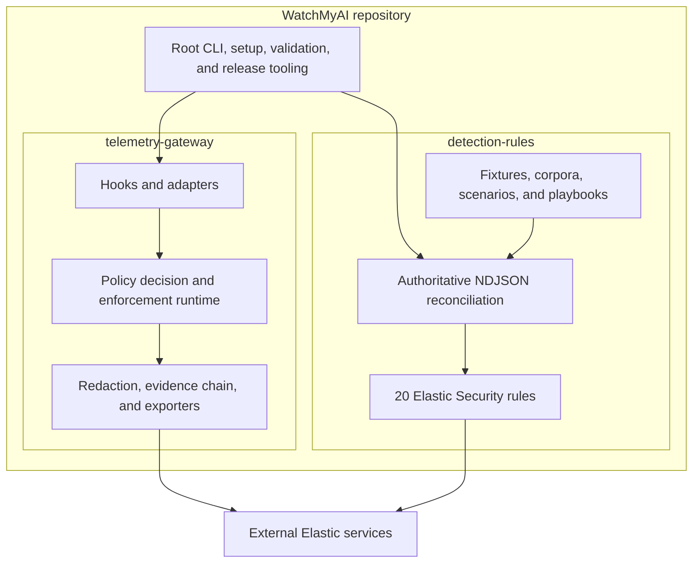
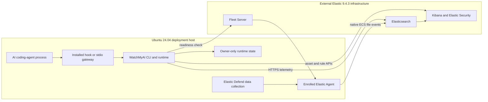
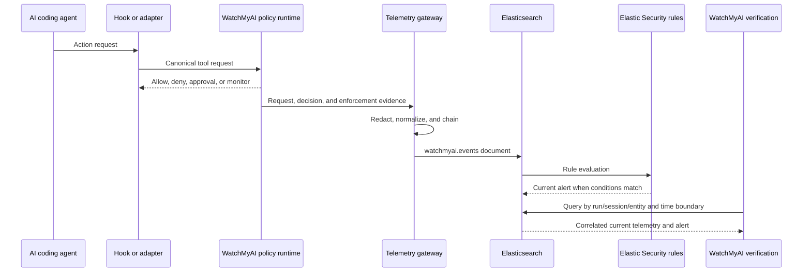
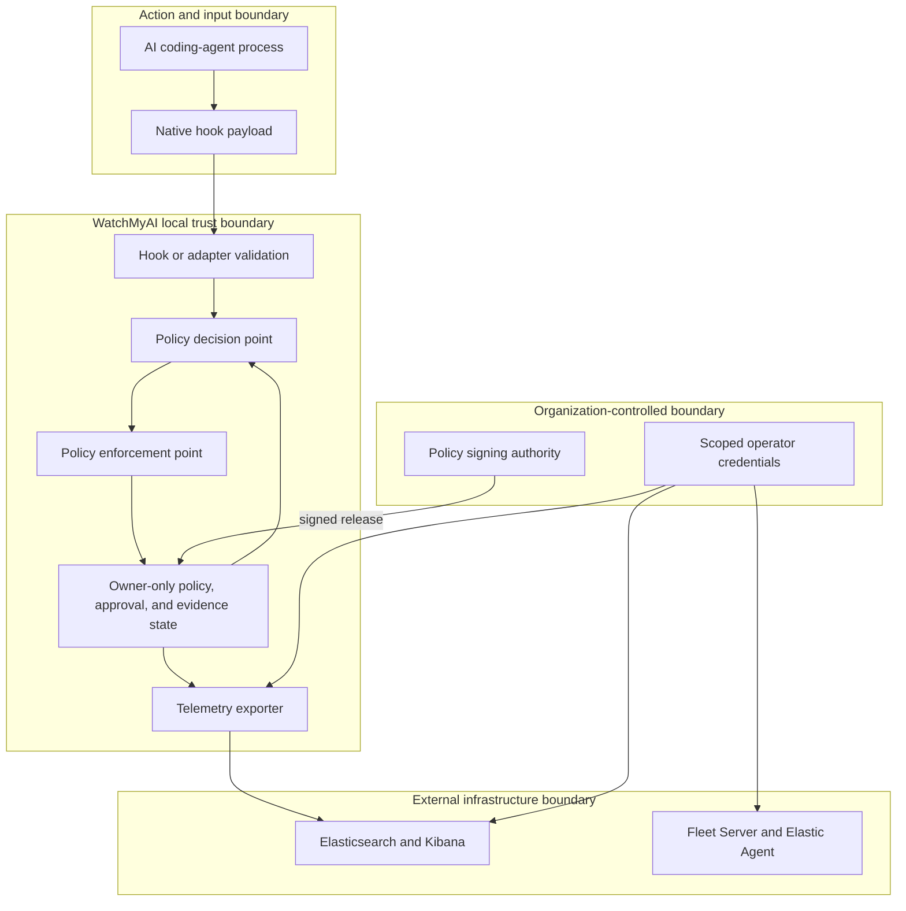

# WatchMyAI architecture

WatchMyAI is one repository, package, installation workflow, and release. Its two internal
technical components are the telemetry gateway and the detection rules. Root tooling connects both
components to the operator and release workflows.

## Project components

`telemetry-gateway/` contains the Python package, the `watchmyai` CLI, policy and approval
services, enforcement points, adapters, normalization, local evidence, and exporters.
`detection-rules/` contains generated active rule objects, synchronized metadata, fixtures,
playbooks, validation, packaging, and a non-deployable deferred research catalog.

The root [`VERSION`](../VERSION), [`pyproject.toml`](../pyproject.toml), and
[`LICENSE`](../LICENSE) apply to both components.

## Validated deployment topology

The v1.0.0 connected path is validated on an Ubuntu 24.04 host using Python 3.11 or 3.12 and
Elasticsearch, Kibana, Fleet Server, and Elastic Agent 9.4.3. The external Elastic services and an
enrolled Agent must exist before setup.

WatchMyAI setup installs its Elastic data-stream assets and rules and adds the non-preventing
Elastic Defend Data Collection preset to the selected Agent policy. It does not provision
Elasticsearch, Kibana, Fleet Server, or enroll Elastic Agent. A dashboard is not part of the
topology; optional Kibana data views and investigation searches do not gate readiness.

## Policy and data flow

1. An AI coding agent requests or performs an action through a supported integration.
2. The hook or adapter validates the native payload and creates a canonical tool request.
3. WatchMyAI classifies the request and evaluates the active policy against registered adapter
   capabilities.
4. The policy enforcement point permits, denies, holds for approval, or monitors the action.
5. The telemetry gateway redacts and normalizes the resulting evidence.
6. Events are appended to the local per-session evidence chain and exported to the
   `watchmyai.events` dataset in `logs-watchmyai.events-*`.
7. Elastic Security rules evaluate WatchMyAI telemetry and selected native ECS file telemetry.
8. Elastic Security creates alerts. `watchmyai verify` and `watchmyai validate` accept only alerts
   correlated to their current run.

The verification path does not insert alerts directly. It emits controlled source evidence, waits
for normal rule scheduling, and rejects historical matches.

## Two telemetry paths

| Path | Rules | Source |
| --- | --- | --- |
| WatchMyAI normalized telemetry | 18 rules | `logs-watchmyai.events-*`, schema 1.1.0, `event.dataset: watchmyai.events` |
| Native file telemetry | `WMAI-023`, `WMAI-024` | `logs-endpoint.events.file-*` and `logs-windows.sysmon_operational-*` ECS file events |

`WMAI-023` aggregates at least 50 file changes or creations by one `process.entity_id` during its
execution window. `WMAI-024` aggregates at least 20 deletions by one process entity. Live
validation creates run-marked paths in a disposable workspace, confirms the matching source-event
entity, and requires the threshold alert to contain the same entity.

## Policy modes and enforcement

Development mode is explicit. Setup generates an unsigned policy restricted to the generated
validation workspace and records unsigned loading in both generated configuration and gateway
state. It is intended for an isolated lab, not as a production fallback.

Production mode requires an organization-provided signed root, signed policy release, and
organization ID. The distribution client verifies signatures, metadata bindings, expiry,
monotonicity, target integrity, and capability compatibility before activation. Missing or invalid
signed policy state does not downgrade to an unsigned policy.

Policy decisions are `ALLOW`, `DENY`, `REQUIRE_APPROVAL`, and `MONITOR`. A pre-tool integration
fails closed when it cannot load or evaluate policy, satisfy a required capability, bind an
approval, or record enforcement evidence. Post-tool and other secondary lifecycle events are
best-effort evidence and are not represented as pre-execution control.

## Trust and security boundaries

The coding-agent process and native payload are untrusted inputs. The adapter boundary is only as
complete as the installed lifecycle-hook coverage. A route that bypasses the hook or configured
MCP gateway is outside WatchMyAI mediation and needs endpoint or service-side controls.

Runtime state lives outside the repository. API keys supplied to setup are stored in owner-only
files; gateway YAML contains a path to an owner-only environment file rather than a bearer value.
No production signing key, Elastic credential, private runtime state, or live evidence belongs in
source control. Validation actions are constrained to the generated disposable workspace.

## Availability and failure behavior

| Condition | Behavior |
| --- | --- |
| Policy unavailable or invalid | A pre-tool hook returns a deny response. Signed mode does not fall back to an unsigned policy. |
| Gateway cannot initialize or record evidence | The pre-tool integration fails closed. Secondary lifecycle evidence reports an error without becoming an enforcement claim. |
| Elastic delivery unavailable after local evidence is recorded | Export retries are bounded, then affected events are written to the local dead-letter file. The already-evaluated policy decision is not rewritten; connected verification fails until delivery recovers. |
| Hooks absent or bypassed | That path is not mediated by WatchMyAI. Setup installs selected hooks, and `watchmyai doctor` reports current status. The v1.0.0 Ubuntu connected verification path does not gate readiness on hook-file presence. |
| Credentials invalid or insufficient | Setup or verification fails with a connectivity, authentication, or privilege error. Credentials are not printed. |
| Fleet policy selection ambiguous | Setup refuses to guess and requires an explicit `FLEET_AGENT_POLICY_ID`. |
| Elastic Agent stopped or unhealthy | Fleet verification fails, and native threshold rules cannot be accepted as validated. |
| Rule disabled or schedule has not completed | Import may be valid, but current-alert verification remains incomplete or fails after the configured timeout. |

The dead-letter path protects evidence from silent export loss, but it is not proof that Elastic
received an event. Operators must monitor it and rerun connected verification after recovery.

## Versioned contracts and limits

- Runtime and package: 1.0.0.
- Organization policy schema: 1.2.
- Telemetry schema: 1.1.0.
- Canonical dataset: `watchmyai.events`.
- Detection scope: exactly 20 production rules, 10 excluded v1.0.0 rules, and 45 deferred research
  definitions.

WatchMyAI is not a kernel sandbox. A deny proves that the mediated request was not released through
that boundary, not that an equivalent bypass was impossible. Static fixtures and retained
historical evidence do not establish current deployment health, recall, false-positive rate, or
universal efficacy.

Related documents: [Setup and configuration](SETUP_AND_CONFIGURATION.md),
[Verification](VERIFICATION.md), and [Detection rules](DETECTION_RULES.md).
